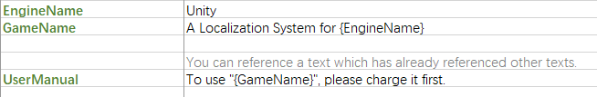
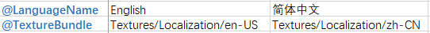
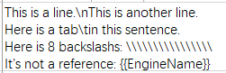
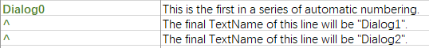
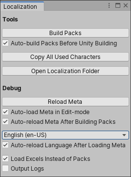

# UnityExtensionsLocalization
This is a Unity localization system that uses excel files during development.

## Features
- You can use multiple excel files, each containing multiple sheets, and each sheet containing only parts of contents of parts of   languages. As the localization system works, it reads all excel files in the Localization directory (include sub-directories) and merges their contents, which means the file organization structure can be customized.

- You can define keywords and then use "{ }" to reference them later.

   
   <em>Keyword Reference</em>

- You can make texts as atrributes. Marking a TextName with an "@" tells the localization system that it is a language attribute. The difference between normal texts and attributes is that attributes can always be accessed without loading the specific language pack. The "LanguageName" attribute is indispensable, which is the localized name of the language. The localization system sorts languages by LanguageName by default, so you can easily create and display a user-friendly list of language choices.

   
   <em>Language Attribute</em>

- Can use the following escape characters: "\n"-line break, "\t"-tab, "\\"-backslash, "{{"-a single "{", "}}"-a single "}".

   
   <em>Escape Character</em>

- If the TextName is "^", it means that it inherits the prefix of the previous line TextName and automatically increments the number of the suffix. This is the automatic numbering function. This requires that the first of a series of automatic numbering must explicitly specify the prefix and initial suffix number. The advantage of using this function is that you don't have to manually modify the TextName when inserting, deleting, or adjusting the order to ensure that the numbers are continuous. The program can also access these rows through a loop.

   
   <em>Automatic Numbering</em>

- You can preview localized contents in edit-mode.

   
   <em>Localization Window</em>

## Installation
Unity can not install dependent packages automatically at present, you have to install them manually:
- https://github.com/yuyang9119/UnityExtensionsCommon
- https://github.com/yuyang9119/UnityExtensionsExcelDataReader

Open the package manager window (menu: Window > Package Manager), select "Add package from git URL...", fill in this in the pop-up textbox: https://github.com/yuyang9119/UnityExtensionsLocalization.git.

## Quick Start
1. Create a "Localization" folder in your project root directory, it is the same directory as the "Assets".
2. Create and edit excel files, save them in the Localization folder ([Download Sample.xlsx](Editor/EditorResources/Sample.xlsx)).
3. Open the Localizaton window in unity (menu: Window > Localization), click "Build Packs".
4. Call LocalizationManager.LoadMetaAsync when your game starts running.
5. Call LocalizationManager.LoadLanguageAsync to load a language.
6. After loading a language, you can call LocalizationManager.GetText to get a localized text.
7. If you want to change language at runtime, just call LocalizationManager.LoadLanguageAsync again.
